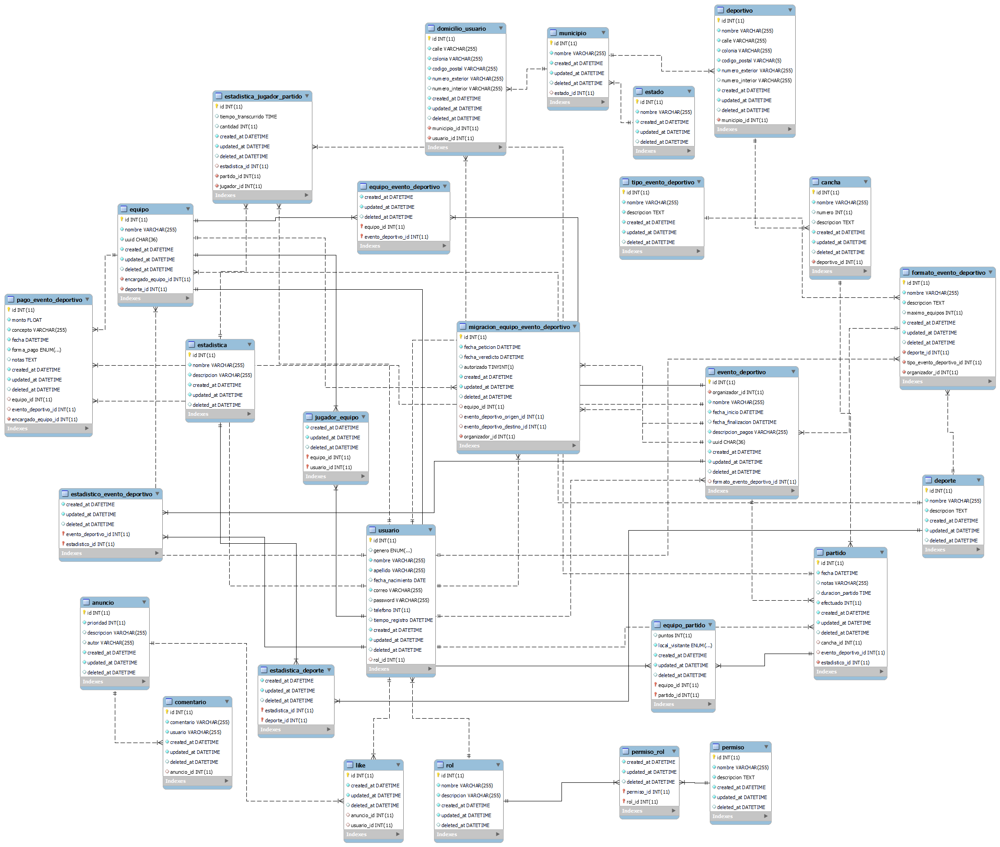

# Administración de Ligas Deportivas: Backend

## Instalación

## Bases de datos

### Diagrama Entidad Relación

## MariaDB

### Instalación

### Creación de la base de datos

## Variables de entorno

## Fuentes

- [Fazt | Nodejs MySQL REST API, Desde cero a Despliegue](https://www.youtube.com/watch?v=3dSkc-DIM74&t=2413s)
