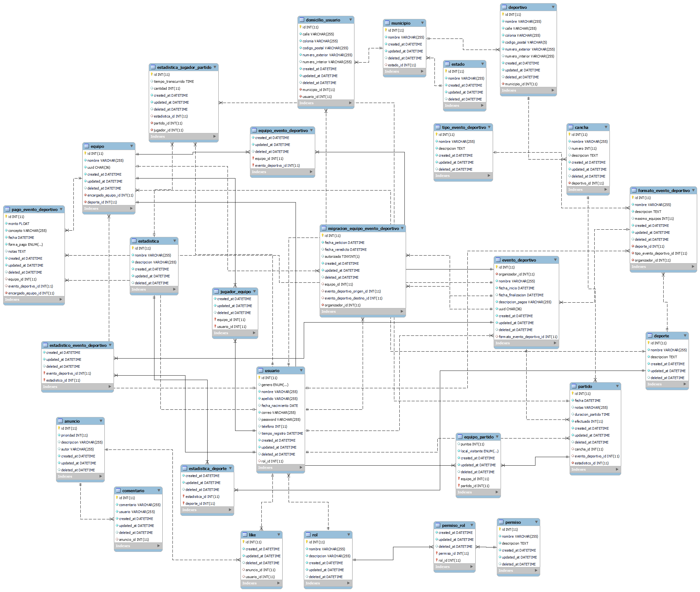

# Administración de Ligas Deportivas: Backend

- [Instalación](#instalación)
- [Diagramas de Entidad Relación](#diagramas-de-entidad-relación)
  - [diagrams.net (Original)](#diagramsnet-original)
  - [MySQL Workbench](#mysql-workbench)
- [MariaDB](#mariadb)
  - [Instalación](#instalación-1)
  - [Creación de la base de datos](#creación-de-la-base-de-datos)
- [Variables de entorno](#variables-de-entorno)
- [Fuentes](#fuentes)

## Instalación

## Diagramas de Entidad Relación

### diagrams.net (Original)

Este diagrama lo creamos manualmente en [diagrams.net](https://app.diagrams.net/).


### MySQL Workbench

Este diagrama fue generado automáticamente por MySQL Workbench al crear la base
de datos. Nos ayuda a corroborar que la base de datos se creó correctamente y
tiene la misma estructura que el diagrama original.



## MariaDB

### Instalación

### Creación de la base de datos

## Variables de entorno

## Fuentes

- [Fazt | Nodejs MySQL REST API, Desde cero a Despliegue](https://www.youtube.com/watch?v=3dSkc-DIM74&t=2413s)
- [Fullstack Open | Part 13: Migraciones, relaciones de muchos-a-muchos](https://fullstackopen.com/es/part13/migraciones_relaciones_de_muchos_a_muchos#relaciones-de-muchos-a-muchos)
- [Client Side Session vs Server Side Session](https://medium.com/@tiff.sage/client-side-session-vs-server-side-session-d506f5408e8c)

## Reemplazar require por import (CommonJS a ES Modules) con Regex en VSCode

Para cambiar la implementación automáticamente sin pasar por cada archivo,
utilicé una expresión regular (Regex) basándome en el artículo ["VS Code: Search-and-Replace Regex"](https://dev.to/rfornal/vs-code-search-and-replace-regex-mn2).

### Encontrar

```bash
# Buscar
## Opción 1
const (.*) = require\("(.*)"\)

## Opción 2
require\(['"](.*)['"]\)

# Reemplazar
import $1 from "$2"


# Al cambiar, las inicializaciones de Router de express quedan así:
#
# import { Router } from "express";

const canchasRouter = Router();
#
# Hay que modificarlo con la siguiente expresión regular:
import (.*) from "express".Router\(\);

# Y reemplazar con la siguiente
const $1 = Router()
```

### Resultado

```diff
# `require` por `import`
- const { loginRouter } = require('./login');
+ import { loginRouter } from "./login";

- const jwt = require("jsonwebtoken");
+ import jwt from "jsonwebtoken";

# "express".Router() por Router()
- import { Router } from "express";

const canchasRouter = Router();
+ import { Router } from "express"
+
+ const canchasRouter = Router()
```
